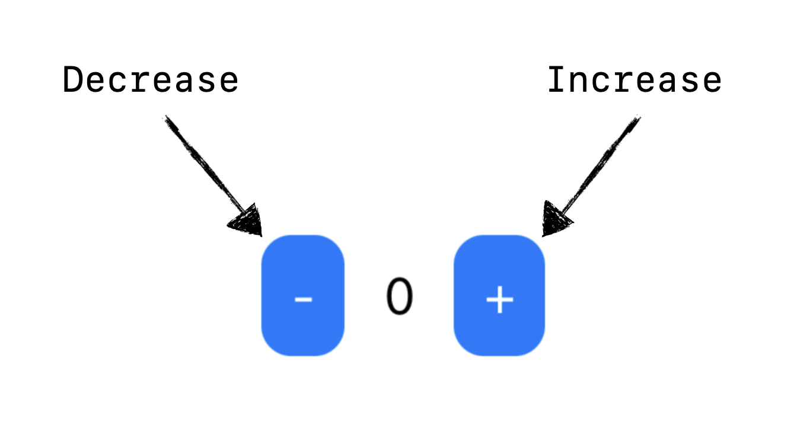
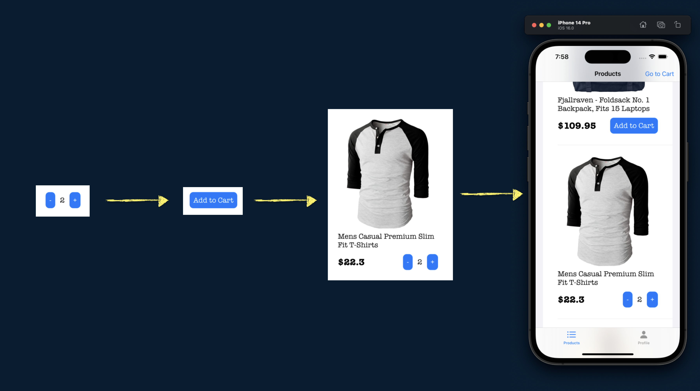
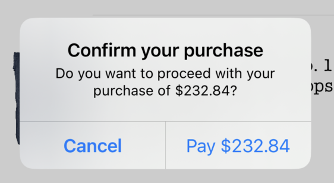

# NOTICE ⚠️
ReducerProtocol Migration will come pretty soon as part of the TCA series. Thanks for your patience!

# Online Store made with Composable Architecture (TCA)
The purpose of this demo is to explore the main concepts of TCA. If this is your first time reading about it, I **strongly** recommend you to read first the README from the [main repo](https://github.com/pointfreeco/swift-composable-architecture) and watch the [Tour of TCA](https://www.pointfree.co/collections/composable-architecture/a-tour-of-the-composable-architecture).

## Content
* [Motivation](#motivation)
* [Screenshots of the app](#screenshots)
* [The basics](#the-basics)
    * [Archiecture Diagram](#archiecture-diagram)
    * [Hello World Example](#hello-world-example)
* [Composition](#composition)
    * [Single states](#single-states)
      * [Scope](#scope)
      * [Pullback](#pullback)
      * [Combine](#combine)
    * [Collection of states](#collection-of-states)
      * [ForEach](#foreach)
* [Environment](#environment)
* [Side Effects](#side-effects)
    * [Network Calls](#network-calls)
* [Testing](#testing)
* [Other Topics](#other-topics)
    * [Opening Modal Views](#opening-modal-views)
    * [Optional States](#optional-states)
    * [Private Actions](#private-actions)
    * [Alert Views in SwiftUI](#alert-views-in-swiftui)
    * [Making a Root Domain with Tab View](#making-a-root-domain-with-tab-view)
* [Contact](#contact)


## Motivation
**TL;DR:** Build an app with TCA not too simple nor too complex to study the most important use cases, and provide concise documentation to new learners.

I wanted to demostrate the power of this great architecture to build applications for Apple ecosystem, like iOS, macOS, etc. (btw, soon will be expanded beyond Apple world! 🚀).

However, if you want to start learning TCA, you will find a lot of articles describing a simple one-screen application to ilustrate the main concepts. Don't get me wrong, that's a great way to start, but I feel that we have a gap between very simple demos and real world applications like [isoword](https://github.com/pointfreeco/isowords) that could be too complex to understand some other important use cases (like navigation and how reducers are glued).

In this demo I've implemented a minimal online store that is actually connecting to a real network API (https://fakestoreapi.com). We got a list of products available, we can choose to add an item to the cart, add more than one item like any other e-commerce app (like Amazon for example), and once you are ready to purchase, move to the cart and send your order to the server.

Of course, we are using fakestoreapi.com, which means your requests aren't going to be processed for real, but all the networks status are, and you can play with it to map what it would be working with network calls using TCA.

Even if this demo is not considered a real-world app, it has enough reducers to ilustrate how data should be glued in order to interact together and isolate domains that only cared for very specific components within the app (For example: Tabs -> Product List -> Product Cell -> Add to Cart button).

Additionally, I've created tests to demostrate one of the key features of TCA and how it makes a test to fail if you didn't capture the actual mutation of your state.

**Note:** Feel free to add any feedback!

## Screenshots
### Tabs
||

### Cart
||

## The basics
### Archiecture Diagram


### Hello World Example
Let's say that you have a simple app with two buttons, one will increase a counter in the screen and the other will decrease it. This is what will happen if this app was implemented on TCA:

1. The view is presented in the screen. It shows the current state of the app.


```swift
struct State: Equatable {
    var counter = 0
}
```

2. The user press a button (let's say increase button), that internally send an action to the store.


```swift
enum Action: Equatable {
    case increaseCounter
    case decreaseCounter
}
```

3. The store & reducer require an environment object, that in TCA is just the object holding your dependencies. If you don't have any dependencies yet, just add an empty Environment.
```swift
struct Environment {
    // Future Dependencies...
}
```


4. The action is received by the reducer and proceed to mutate the state. Reducer MUST also return an effect, that represent logic from the "outside world" (network calls, notifications, database, etc). If no effect is needed, just return `Effect.none` .

```swift
let reducer = Reducer<
    State, Action, Environment
> { state, action, environment in
    switch action {
    case .increaseCounter:
        state.counter += 1
        return Effect.none
    case .decreaseCounter:
        state.counter -= 1
        return Effect.none
    }
}
```

5. Once the mutation is done and the reducer returned the effect, the view will render the update in the screen. 


7. To observe object in TCA, we need an object called `viewStore`, that in this example is wrapped within WithViewStore view.
8. We can send another action using `viewStore.send()` and an `Action` value.

```swift
struct ContentView: View {
    let store: Store<State, Action>

    var body: some View {
        WithViewStore(self.store) { viewStore in
            HStack {
                Button {
                    viewStore.send(.decreaseCounter)
                } label: {
                    Text("-")
                        .padding(10)
                        .background(.blue)
                        .foregroundColor(.white)
                        .cornerRadius(10)
                }
                .buttonStyle(.plain)

                Text(viewStore.counter.description)
                    .padding(5)

                Button {
                    viewStore.send(.increaseCounter)
                } label: {
                    Text("+")
                        .padding(10)
                        .background(.blue)
                        .foregroundColor(.white)
                        .cornerRadius(10)
                }
                .buttonStyle(.plain)
            }
        }
    }
}
```

8. View is initialized by a `Store` object.

```swift
ContentView(
    store: Store(
        initialState: State(),
        reducer: reducer,
        environment: Environment()
    )
)
```

If you want to learn more about the basics, check out the following [video](https://youtu.be/SfFDj6qT-xg)

## Composition

Composition refers to the process of building complex software systems by combining smaller, reusable software components. Take a look to this image:



We started with a simple button counter, then we add an extra state to display text, next we put the whole button in a Product cell, and finally, each product cell will be part of a Product list. That is composition!

### Single states

For single states (all, except collections/lists), TCA provides operators to glue the components and make bigger ones.

#### Scope 
Scope will expose from parent domain (Product) only the required state and action for the child domain (AddToCart). For example, the ProductDomain below contains two properties as part of its state: product and addToCartState.

```swift
struct ProductDomain {
    struct State: Equatable, Identifiable {
        let product: Product
        var addToCartState = AddToCartDomain.State()
    }
    // ...
```
We don't want to pass around the whole ProductDomain state, instead, we want to reduce the scope as much as possible. In order to do that, we use scope on the child component:

```swift
AddToCartButton(
    store: self.store.scope(
        state: \.addToCartState,
        action: ProductDomain.Action.addToCart
    )
)
```
In this way, AddToCart Domain will only know about its own state and nothing about product and more.

#### Pullback

Pullback works like a mapping function. It transforms the child reducer (AddToCart) into one compatible with parent reducer (Product).
```swift
AddToCartDomain.reducer
    .pullback(
        state: \.addToCartState,
        action: /ProductDomain.Action.addToCart,
        environment: { _ in
            AddToCartDomain.Environment()
        }
    )
```
This transformation will be really useful when we combine multiple reducers to build a more complex component.

#### Combine

Combine operator will combine many reducers into a single one by running each one on state in order, and merging all of the effects.
```swift
static let reducer = Reducer<
    State, Action, Environment
>.combine(
    AddToCartDomain.reducer
        .pullback(
            state: \.addToCartState,
            action: /ProductDomain.Action.addToCart,
            environment: { _ in
                AddToCartDomain.Environment()
            }
        ),
    .init { state, action, environment in
        switch action {
        case .addToCart(.didTapPlusButton):
            return .none
        case .addToCart(.didTapMinusButton):
            state.addToCartState.count = max(0, state.addToCartState.count)
            return .none
        }
    }
)
```
With the help of pullback operators, the child reducers can work along with the parent domain to execute each action in order. 

Be careful because we have to move the parent reducer at the end to run the child reducers first and then capture any [side effects](#side-effects) (note: this is not required in ReducerProtocol anymore).

If you want to learn more about these operators, check out this [video](https://youtu.be/Zf2pFEa3uew).

### Collection of states

What about having multiple states to manage?, TCA also have great support for that.

As a first step, we need to hold a list of (Product) states using IdentifiedArray instead of a regular array:
```swift
struct ProductListDomain {
    struct State: Equatable {
        var productListState: IdentifiedArrayOf<ProductDomain.State> = []
        // ...    
    }
    // ...
}
```

#### ForEach

`forEach` operator it's basically a pullback operator, but it will work for a collection of states, transforming the child reducers into ones compatible with parent reducer:

```swift
struct ProductListDomain {
    // State and Actions ...
    
    static let reducer = Reducer<
        State, Action, Environment
    >.combine(
        ProductDomain.reducer.forEach(
            state: \.productListState,
            action: /ProductListDomain.Action.product(id:action:),
            environment: { _ in ProductDomain.Environment() }
        ),
        // More Reducers ...
        .init { state, action, environment in
            switch action {
                // ...
            }
        }
    )
}
```

Then in the UI, we use ForEachStore to iterate over all the (Product) states and actions. This will make possible sending actions to the respective cell and mutate its state.
```swift
List {
    ForEachStore(
        self.store.scope(
            state: \.productListState,
            action: ProductListDomain.Action
                .product(id: action:)
        )
    ) {
        ProductCell(store: $0)
    }
}
```

If you want to learn more about forEach operator and ForEachStore, check out this [video](https://youtu.be/sid-zfggYhQ)

## Environment

The environment is a structure that contains all the dependencies needed by the application to perform its tasks. It was part of the TCA foundation before the introduction of [ReducerProtocol](https://www.pointfree.co/blog/posts/81-announcing-the-reducer-protocol) and [Dependencies Framework](https://github.com/pointfreeco/swift-dependencies).

```swift
struct Environment {
    var fetchProducts:  () async throws -> [Product]
    var sendOrder: ([CartItem]) async throws -> String
    var uuid: () -> UUID
}
```

If you want to learn more about how Environment object works on TCA, take a look to this [video](https://youtu.be/sid-zfggYhQ?list=PLHWvYoDHvsOVo4tklgLW1g7gy4Kmk4kjw&t=103)

## Side Effects

A side effect is an observable change that occurs as a result of running a function or method. This can include things like modifying state outside of the function, performing I/O operations like reading or writing to a file, or making network requests. 
TCA helps to encapsulate those side effects through Effects objects.


If you want to learn more about side effects, check out this [video](https://youtu.be/t3HHam3GYkU)

### Network calls

Network calls are one of the most common tasks in mobile development, and of course, TCA provides tools for that. And since network calls are part of the outside world (side effects), we use Effect object to wrap the calls, more specifically, into Effect.task.

However, this task operator will only call the web API, but to get the actual response, we have to implement an additional action that will hold the result in a TaskResult:

```swift
struct ProductListDomain {
    // State and more ...
    
    enum Action: Equatable {
        case fetchProducts
        case fetchProductsResponse(TaskResult<[Product]>)
   }
   
   struct Environment {
        var fetchProducts: () async throws -> [Product]
        var uuid: () -> UUID
    }
    
    static let reducer = Reducer<
        State, Action, Environment
    >.combine(
        // Other child reducers...
        .init { state, action, environment in
            switch action {
            case .fetchProducts:
                return .task {
                    // Just making the call 
                    await .fetchProductsResponse(
                        TaskResult { try await environment.fetchProducts() }
                    )
                }
            case .fetchProductsResponse(.success(let products)):
                // Getting the success response
                state.productListState = IdentifiedArrayOf(
                    uniqueElements: products.map {
                        ProductDomain.State(
                            id: environment.uuid(),
                            product: $0
                        )
                    }
                )
                return .none
            case .fetchProductsResponse(.failure(let error)):
                // Getting an error from the web API
                print("Error getting products, try again later.", error)
                return .none
            }
        }
    )
}
```

For information about network requests in TCA, check out this [video](https://youtu.be/sid-zfggYhQ?list=PLHWvYoDHvsOVo4tklgLW1g7gy4Kmk4kjw&t=144) explaining async requests, and this other [video](https://youtu.be/j2qymM6i9n4) configuring a real web API call.

## Testing

TBD

## Other topics

### Opening Modal Views

If you require to open a view modally in SwiftUI, you will need to use sheet modifier and provide a binding parameter:
```swift
func sheet<Content>(
    isPresented: Binding<Bool>,
    onDismiss: (() -> Void)? = nil, @ViewBuilder content: @escaping () -> Content
) -> some View where Content : View
```

In other to use this (or any modifier with binding parameters) in TCA, we must use `binding` operator from `viewStore`and provide two parameters:
* The state property that will be mutated.
* the action that will trigger the mutation.

```swift
Text("Parent View")
.sheet(
    isPresented: viewStore.binding(
        get: \.shouldOpenModal,
        send: Action.setModalView(isPresented:)
    )
) {
    Text("I'm a Modal View!")
}
```

If you want to lean more about Binding with TCA and SwiftUI, take a look to this [video](https://youtu.be/Ilr8AsoggIY).

### Optional States

By default, a TCA's state will be kept in memory during the app's lifecycle. However, there are cases where having a state alive is just a waste of resources. For example, a modal view is only displayed a short period of time, it doesn't make sense to keep its state in memory all the time, for that we have optional states.

The way to create an optional state is similar to any optional value in Swift, just declare the property in the parent state, but instead of assigning a default value, let's declare it as optional. In this example, cartState will hold an optional state for a Cart List:

```swift
struct ProductListDomain {
    struct State: Equatable {
        var productListState: IdentifiedArrayOf<ProductDomain.State> = []
        var shouldOpenCart = false
        var cartState: CartListDomain.State?
        
        // More properties...
    }
}
```

Now in the reducer, we have to use pullback operator to transform the child (CartList) reducer into one compatible with parent (ProductList) reducer, however, pullback doesn't accept optional states. In order to make this work, we need to use `optional` operator, which will enable the reducer once the state is non-nil.

To assign a new non-optional state, the parent reducer will have to initialize the property (cartState) once a specific action is called (setCartView).

```swift
static let reducer = Reducer<
        State, Action, Environment
    >.combine(
        // More reducers ...
        CartListDomain.reducer
            .optional()
            .pullback(
                state: \.cartState,
                action: /ProductListDomain.Action.cart,
                environment: {
                    CartListDomain.Environment(
                        sendOrder: $0.sendOrder
                    )
                }
            ),
        .init { state, action, environment in
            switch action {
            //  More cases ...
            case .setCartView(let isPresented):
                state.shouldOpenCart = isPresented
                state.cartState = isPresented
                ? CartListDomain.State(...)
                : nil
                return .none
            }
        }
    )
```

Finally, use `IfLetStore` to unwrap a store of optional state in order to show the respective view that will work with that state. 


```swift
List {
    ForEachStore(
        self.store.scope(
            state: \.productListState,
            action: ProductListDomain.Action
                .product(id: action:)
        )
    ) {
        ProductCell(store: $0)
    }
}
.sheet(
    isPresented: viewStore.binding(
        get: \.shouldOpenCart,
        send: ProductListDomain.Action.setCartView(isPresented:)
    )
) {
    IfLetStore(
        self.store.scope(
            state: \.cartState,
            action: ProductListDomain.Action.cart
        )
    ) {
        CartListView(store: $0)
    }
}
```

If you want to learn more about optional states, check out this [video](https://youtu.be/AV0laQw2OjM).

### Private Actions

By default, if you declare an action in a TCA domain, it will be available for other reducers too. There are cases where an action is very specific for a reducer and we don't need to expose it outside of it. For those cases, you can simply declare private functions:

```swift
static let reducer = Reducer<
    State, Action, Environment
>.combine(
    // More reducers ...
    .init { state, action, environment in
        switch action {
        // More actions ...
        case .cart(let action):
            switch action {
            case .didPressCloseButton:
                return closeCart(state: &state)
            case .dismissSuccessAlert:
                resetProductsToZero(state: &state)

                return .task {
                    .closeCart
                }
            }
        case .closeCart:
            return closeCart(state: &state)
        }
    }
)

private static func closeCart(
        state: inout State
) -> Effect<Action, Never> {
    state.shouldOpenCart = false
    state.cartState = nil

    return .none
}

private static func resetProductsToZero(
    state: inout State
) {
    for id in state.productListState.map(\.id)
    where state.productListState[id: id]?.count != 0  {
        state.productListState[id: id]?.addToCartState.count = 0
    }
}
```

For more about private actions, check out this [video](https://youtu.be/7BkZX_7z-jw).

### Alert Views in SwiftUI

TCA library provides support for AlertView too adding its own state and way to build UI to keep consistency without the architecture. Here's how you can create your own alert:

1. Create an AlertState with actions of your own domain.
2. Create the actions that will trigger events for the alert:
    - Initialize AlertState (`didPressPayButton`)
    - Dismiss the alert (`didCancelConfirmation`)
    - Execute the alert's handler (`didConfirmPurchase`)

```swift
struct CartListDomain {
    struct State: Equatable {
        var confirmationAlert: AlertState<CartListDomain.Action>?
        
        // More properties ...
    }
    
    enum Action: Equatable {
        case didPressPayButton
        case didCancelConfirmation
        case didConfirmPurchase
        
        // More actions ...
    }
    
    static let reducer = Reducer<
        State, Action, Environment
    >.combine(
        CartItemDomain.reducer.forEach(
            state: \.cartItems,
            action: /CartListDomain.Action.cartItem(id:action:),
            environment: { _ in CartItemDomain.Environment() }
        ),
        .init { state, action, environment in
            switch action {
            case .didCancelConfirmation:
                state.confirmationAlert = nil
                return .none
            case .didConfirmPurchase:
                // Sent order and Pay ...
            case .didPressPayButton:
                state.confirmationAlert = AlertState(
                    title: TextState("Confirm your purchase"),
                    message: TextState("Do you want to proceed with your purchase of \(state.totalPriceString)?"),
                    buttons: [
                        .default(
                            TextState("Pay \(state.totalPriceString)"),
                            action: .send(.didConfirmPurchase)),
                        .cancel(TextState("Cancel"), action: .send(.didCancelConfirmation))
                    ]
                )
                return .none
            // More actions ...
            }
        }
    )
}
                
```

3. Invoke the UI



```swift
let store: Store<CartListDomain.State, CartListDomain.Action>

Text("Parent View")
.alert(
    self.store.scope(state: \.confirmationAlert),
    dismiss: .didCancelConfirmation
)
```

This [video](https://youtu.be/U3EMduy-DhE) explains more about AlertView in SwiftUI and TCA.

### Making a Root Domain with Tab View

Creating a Root Domain is like creating any other domain in TCA. Each property in this state will represent a complex substate. For Tab logic, we simply add an enum representing each tab item:

```swift
struct RootDomain {
    struct State: Equatable {
        var selectedTab = Tab.products
        var productListState = ProductListDomain.State()
        var profileState = ProfileDomain.State()
    }
    
    enum Tab {
        case products
        case profile
    }
    
    enum Action: Equatable {
        case tabSelected(Tab)
        case productList(ProductListDomain.Action)
        case profile(ProfileDomain.Action)
    }
    
    struct Environment {
        // Dependencies
        
        static let live = Self(
            // Dependency Initialization
        )
    }
    
    static let reducer = Reducer<
        State, Action, Environment
    >.combine(
        ProductListDomain.reducer
            .pullback(...),
        ProfileDomain.reducer
            .pullback(...),
        .init { state, action, environment in
            switch action {
            case .productList:
                return .none
            case .tabSelected(let tab):
                state.selectedTab = tab
                return .none
            case .profile:
                return .none
            }
        }
    )
}
```

For the UI, it's almost identical to vanilla SwiftUI, except we are holding the store property to manage the current selected tab:
```swift
struct RootView: View {
    let store: Store<RootDomain.State, RootDomain.Action>
    
    var body: some View {
        WithViewStore(self.store) { viewStore in
            TabView(
                selection: viewStore.binding(
                    get: \.selectedTab,
                    send: RootDomain.Action.tabSelected
                )
            ) {
                ProductListView(
                    store: self.store.scope(
                        state: \.productListState,
                        action: RootDomain.Action
                            .productList
                    )
                )
                .tabItem {
                    Image(systemName: "list.bullet")
                    Text("Products")
                }
                .tag(RootDomain.Tab.products)
                ProfileView(
                    store: self.store.scope(
                        state: \.profileState,
                        action: RootDomain.Action.profile
                    )
                )
                .tabItem {
                    Image(systemName: "person.fill")
                    Text("Profile")
                }
                .tag(RootDomain.Tab.profile)
            }
        }
    }
}
```

Check out the full details of this implementation in this [video](https://youtu.be/a_FwMVIhCHY).
## Contact
* [Twitter](https://twitter.com/swiftandtips)
* [LinkedIn](https://www.linkedin.com/in/pedrorojaslo/)
* [Mastodon](https://iosdev.space/@swiftandtips)
