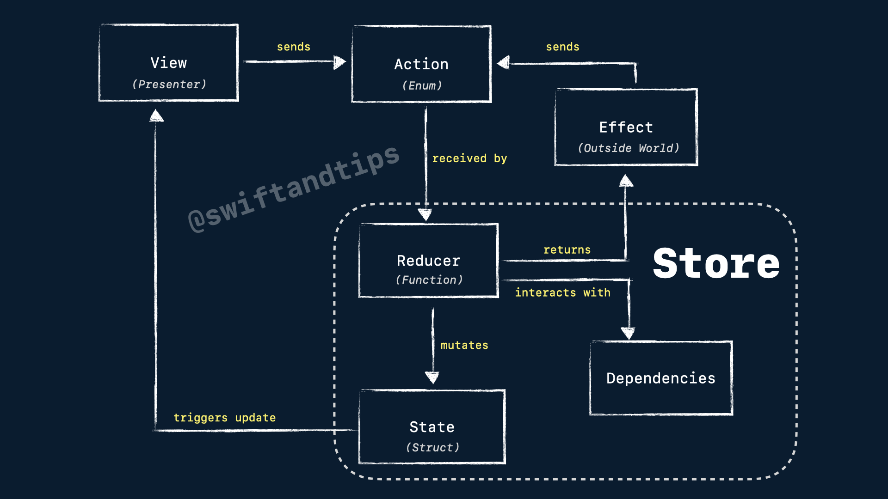

# Before starting
- This demo was implemented using version [1.15.0](https://pointfreeco.github.io/swift-composable-architecture/1.14.0/documentation/composablearchitecture/) of TCA.
- The demo runs on iOS 17.6 and above.
- The [Testing](#testing) section is still a WIP.
- All credits about TCA go to [Brandon Willams](https://twitter.com/mbrandonw), [Stephen Celis](https://twitter.com/stephencelis) and the incredible team at [pointfree.co](https://www.pointfree.co/) ❤️.

# Online Store made with Composable Architecture (TCA)
The purpose of this demo is to provide an introduction to the main concepts of TCA. If you are new to TCA, I **highly** recommend starting with the README from the [main repository](https://github.com/pointfreeco/swift-composable-architecture) and watching the informative [Tour of TCA](https://www.pointfree.co/collections/composable-architecture/a-tour-of-the-composable-architecture). These resources will provide you with a solid foundation and a comprehensive understanding of the TCA framework.

## Content
* [Motivation](#motivation)
* [Screenshots of the app](#screenshots)
* [The basics](#the-basics)
    * [Archiecture Diagram](#archiecture-diagram)
    * [Hello World Example](#hello-world-example)
* [Composition](#composition)
    * [Body to compose multiple Reducers](#body-to-compose-multiple-reducers)
    * [Single state operators](#single-state-operators)
      * [store.scope(state:action:)](#storescopestateaction)
      * [Scope in Reducers](#scope-in-reducers)
    * [Collection of states](#collection-of-states)
      * [forEach in Reducer](#foreach-in-reducer)
* [Dependencies](#dependencies)
* [Side Effects](#side-effects)
    * [Network Calls](#network-calls)
* [Navigation](#navigation)
    * [Alerts](#alerts)
    * [Sheets](#sheets)
* [Testing](#testing)
    * [Basics](#testing-basics)
    * [Side Effects](#testing-side-effects)
    * [CasePathable](#testing-CasePathable)
* [Other Topics](#other-topics)
    * [Optional States](#optional-states)
    * [Private Actions](#private-actions)
    * [Bindable Action](#bindable-actions)
    * [Delegate Action](#delegate-actions)
    * [View Action](#view-actions)
    * [Making a Root Domain with Tab View](#making-a-root-domain-with-tab-view)
* [Contact](#contact)


## Motivation
**TL;DR:** This project aims to build an app using TCA, striking a balance between simplicity and complexity. It focuses on exploring the most important use cases of TCA while providing concise and accessible documentation for new learners. The goal is to create a valuable learning resource that offers practical insights into using TCA effectively.

I aimed to showcase the power of the TCA architecture in building robust applications for the Apple ecosystem, including iOS, macOS, and more excitingly, its future expansion beyond the Apple world! 🚀

While there are many articles available that demonstrate simple one-screen applications to introduce TCA's core concepts, I noticed a gap between these basic demos and real-world applications like [isoword](https://github.com/pointfreeco/isowords), which can be complex and challenging to understand certain important use cases (like navigation and how reducers are glued).

In this demo, I have implemented a minimal online store that connects to a real network API (https://fakestoreapi.com). It features a product list, the ability to add items to the cart, and the functionality to place orders. While the requests are not processed in real-time (as it uses a fake API), the network status is simulated, allowing you to experience the interaction and mapping of network calls using TCA.

While this demo may not be a full-scale real-world application, it includes enough reducers to illustrate how data can be effectively connected and how domains can be isolated to handle specific components within the app (e.g., Tabs -> Product List -> Product Cell -> Add to Cart button).

Furthermore, I have created tests to demonstrate one of TCA's key features: ensuring that tests fail if the expected state mutations are not captured accurately. This showcases how TCA promotes testability and helps ensure the correctness of your application.

If you're looking to dive into TCA, this demo provides a valuable middle ground between simple examples and complex projects, offering concise documentation and practical insights into working with TCA in a more realistic application setting.

Any feedback is welcome! 🙌🏻

## Screenshots
### Tabs
||

### Cart
||

## The basics
### Archiecture Diagram


### Hello World Example
Consider the following implementation of a simple app using TCA, where you will have two buttons: one to increment a counter displayed on the screen and the other to decrement it.

Here's an example of how this app would be coded with TCA:

1. A struct that will represent the domain of the feature using the @Reducer macro. In the past, the reducer needed an state, an action and reduce method but now, it is not a requirement.

```swift
@Reducer
struct CounterDomain {
}
```

2. The view that is presented in the screen will display the current state of the app.


```swift
@Reducer
struct CounterDomain {
    struct State: Equatable {
        var counter = 0
    }
}
```

3. When the user presses a button (let's say increase button), it will internally send an action to the store.


```swift
@Reducer
struct CounterDomain {
    struct State: Equatable {
        var counter = 0
    }
    enum Action: Equatable {
        case increaseCounter
        case decreaseCounter
    }
}
```

4. The action will be received by the reducer and proceed to mutate the state. Reducer MUST also return an effect, that represent logic from the "outside world" (network calls, notifications, database, etc). If no effect is needed, just return `Effect.none` .

```swift
@Reducer
struct CounterDomain {
    struct State: Equatable {
        var counter = 0
    }
    enum Action: Equatable {
        case increaseCounter
        case decreaseCounter
    }
    func reduce(into state: inout State, action: Action) -> Effect<Action> {
        switch action {
        case .increaseCounter:
            state.counter += 1
            return .none
        case .decreaseCounter:
            state.counter -= 1
            return .none
        }
    }
}
```

5. Once the mutation is done and the reducer returned the effect, the view will render the update in the screen. 


7. To observe state changes in TCA, use directly store. If you are using a previous version than iOS 17, you need to use WithPerceptionTracking. We can send an action from the view to the store using `store.send()` and an `Action` value.

```swift
struct ContentView: View {
    let store: StoreOf<CounterDomain>

    var body: some View {
        WithPerceptionTracking {
            HStack {
                Button {
                    store.send(.decreaseCounter)
                } label: {
                    Text("-")
                        .padding(10)
                        .background(.blue)
                        .foregroundColor(.white)
                        .cornerRadius(10)
                }
                .buttonStyle(.plain)

                Text(store.counter.description)
                    .padding(5)

                Button {
                    store.send(.increaseCounter)
                } label: {
                    Text("+")
                        .padding(10)
                        .background(.blue)
                        .foregroundColor(.white)
                        .cornerRadius(10)
                }
                .buttonStyle(.plain)
            }
        }
    }
}
```

7. View is initialized by a `Store` object.

```swift
ContentView(
    store: Store(
        initialState: CounterDomain.State(),
        reducer: { CounterDomain() }
    )
)
```

If you want to learn more about the basics, check out the following [video](https://youtu.be/SfFDj6qT-xg)

> Note: The videos shared here were made using the legacy version of TCA with Environment and without `Reducer`. If you want to see the legacy version of TCA, check out this [branch](https://github.com/pitt500/OnlineStoreTCA/tree/legacy-tca-with-environment).

## Composition

Composition refers to the process of building complex software systems by combining smaller, reusable software components. Take a look to this image:


We started with a simple button counter, then we add an extra state to display text, next we put the whole button in a Product cell, and finally, each product cell will be part of a Product list. That is composition!

### Body to compose multiple Reducers
In the previous example, we demonstrated the usage of `reduce(into:action:)` to create our reducer function and define how state will be modified for each action. However, it's important to note that this method is suitable only for leaf components, which refer to the smallest components in your application.

For larger components, we can leverage the `body` property provided by the `Reducer`. This property enables you to combine multiple reducers, facilitating the creation of more comprehensive components. By utilizing the `body` property, you can effectively compose and manage the state mutations of these larger components.
```swift
var body: some ReducerOf<Self> {
    ChildReducer1()
    Reduce { state, action in
        switch action {
        case .increaseCounter:
            state.counter += 1
            return .none
        case .decreaseCounter:
            state.counter -= 1
            return .none
        }
    }
    ChildReducer2()
}
```

The `Reduce` closure will always encapsulate the logic from the parent domain. To understand how to combine additional components, please continue reading below.

> Compared to the previous version of TCA without `Reducer`, the order of child reducers will not affect the result. Parent Reducer (`Reduce`) will be always executed at the end.

### Single state operators

For single states (all except collections/lists), TCA provides operators to glue the components and make bigger ones.

#### store.scope(state:action:) 
`store.scope` is an operator used in views to get the child domain's (`AddToCartDomain`) state and action from parent domain (`ProductDomain`) to initialize subviews. 
For example, the `ProductDomain` below contains two properties as part of its state: `product` and `addToCartState`.

```swift
@Reducer
struct ProductDomain {
    struct State: Equatable, Identifiable {
        let product: Product
        var addToCart = AddToCartDomain.State()
    }
    // ...
```

Furthermore, we utilize an action with an associated value that encapsulates all actions from the child domain, providing a comprehensive and cohesive approach.
```swift
@Reducer
struct ProductDomain {
    // State ...

    enum Action {
        case addToCart(AddToCartDomain.Action)
    }
    // ...
```

Let's consider the scenario where we need to configure the `ProductCell` view below. The `ProductCell` is designed to handle the `ProductDomain`, while we need to provide some information to initialize the `AddToCartButton`. However, the `AddToCartButton` is only aware of its own domain, `AddToCartDomain`, and not the `ProductDomain`. To address this, we can use the `scope` method from `store` to get the child's state and action from parent domain. This enables us to narrow down the scope of the button to focus solely on its own functionality.

```swift
struct ProductCell: View {
    let store: StoreOf<ProductDomain>
    
    var body: some View {
        WithPerceptionTracking {
            // More views here ...
            AddToCartButton(
                store: self.store.scope(
                    state: \.addToCart,
                    action: \.addToCart
                )
            )
        }
    }
```
By employing this approach, the `AddToCartDomain` will solely possess knowledge of its own state and remain unaware of any product-related information.

#### Scope in Reducers
`Scope` is utilized within the `body` to seamlessly transform the child reducer (`AddToCart`) into a compatible form that aligns with the parent reducer (`Product`). This allows for smooth integration and interaction between the two.
```swift
var body: some ReducerOf<Self> {
    Scope(state: \.addToCart, action: \.addToCart) {
        AddToCartDomain()
    }
    Reduce { state, action in
        // Parent Reducer logic ...
    }
}
```
This transformation becomes highly valuable when combining multiple reducers to construct a more complex component.

> In earlier versions, the `pullback` and `combine` operators were employed to carry out the same operation. You can watch this [video](https://youtu.be/Zf2pFEa3uew).

### Collection of states

Are you looking to manage a collection of states? TCA offers excellent support for that as well!

In this particular example, instead of using a regular array, TCA requires a list of (`Product`) states, which can be achieved by utilizing `IdentifiedArray`:
```swift
@Reducer
struct ProductListDomain {
    struct State: Equatable {
        var products: IdentifiedArrayOf<ProductDomain.State> = []
        // ...    
    }
    enum Action: Equatable {
        case products(IdentifiedActionOf<ProductDomain>)
    }
}
```

#### forEach in Reducer

The `forEach` operator functions similarly to the [`Scope`](#scope-in-reducers) operator, with the distinction that it operates on a collection of states. It effectively transforms the child reducers into compatible forms that align with the parent reducer.

```swift
@Reducer
struct ProductListDomain {
    // State and Actions ...
    
    var body: some ReducerOf<Self> {
        Reduce { state, action in
            // Parent Reducer...
        }
        .forEach(\.products, action: \.products) {
            ProductDomain()
        }
    }
}
```

Subsequently, in the user interface, we employ SwiftUI `ForEach` modifier and `store.scope` to iterate through all the (`Product`) states and actions. This enables us to send actions to the corresponding cell and modify its state accordingly.

Remember that `WithPerceptionTracking` is not necessary when you are in iOS 17 and above.
```swift
List {
    ForEach(
        self.store.scope(
            state: \.products,
            action: \.products
        ),
        id: \.id
    ) {
        WithPerceptionTracking {
            ProductCell(store: $0)
        }
    }
}
```

> There's a legacy `forEach` operator, If you want to learn more, check out this [video](https://youtu.be/sid-zfggYhQ)

## Dependencies
In previous iterations of TCA, `Environment` played a crucial role in consolidating all the dependencies utilized by a domain.

With the introduction of the [`Reducer`](https://www.pointfree.co/blog/posts/81-announcing-the-reducer-protocol), we have eliminated the concept of `Environment`. As a result, dependencies now reside directly within the domain.

```swift
@Reducer
struct ProductListDomain {
    // State ...

    // Actions...

    var fetchProducts:  () async throws -> [Product]
    var sendOrder: ([CartItem]) async throws -> String
    var uuid: () -> UUID

    // Reducer ...
}
```

Nevertheless, we have the option to leverage the [Dependencies Framework](https://github.com/pointfreeco/swift-dependencies) to achieve a more enhanced approach in managing our dependencies:

```swift
@Reducer
struct ProductListDomain {
    // State ...

    // Actions...

    @Dependency(\.apiClient.fetchProducts) var fetchProducts
    @Dependency(\.apiClient.sendOrder) var sendOrder
    @Dependency(\.uuid) var uuid

    // Reducer ...
}
```

> If you want to learn more about how Environment object works on TCA, take a look to this [video](https://youtu.be/sid-zfggYhQ?list=PLHWvYoDHvsOVo4tklgLW1g7gy4Kmk4kjw&t=103)

## Side Effects
A side effect refers to an observable change that arises when executing a function or method. This encompasses actions such as modifying state outside the function, performing I/O operations to a file or making network requests. TCA facilitates the encapsulation of such side effects through the use of `Effect` objects.


> If you want to learn more about side effects, check out this [video](https://youtu.be/t3HHam3GYkU)

### Network calls
Network calls are a fundamental aspect of mobile development, and TCA offers robust tools to handle them efficiently. As network calls are considered external interactions or [side effects](#side-effects), TCA utilizes the `Effect` object to encapsulate these calls. Specifically, network calls are encapsulated within the `Effect.task` construct, allowing for streamlined management of asynchronous operations within the TCA framework.

However, it's important to note that the task operator alone is responsible for making the web API call. To obtain the actual response, an additional action needs to be implemented, which will capture and store the result within a `TaskResult` object.

```swift
@Reducer
struct ProductListDomain {
    // State and more ...
    
    enum Action: Equatable {
        case fetchProducts
        case fetchProductsResponse(TaskResult<[Product]>)
    }
   
    @Dependency(\.apiClient.fetchProducts) var fetchProducts
    @Dependency(\.uuid) var uuid
    
    var body: some ReducerOf<Self> {
        // Other child reducers...
        Reduce { state, action in
            switch action {
            case .fetchProducts:
                return .task {
                    // Just making the call 
                    await .fetchProductsResponse(
                        TaskResult { try await self.fetchProducts() }
                    )
                }
            case .fetchProductsResponse(.success(let products)):
                // Getting the success response
                state.productListState = IdentifiedArrayOf(
                    uniqueElements: products.map {
                        ProductDomain.State(
                            id: uuid(),
                            product: $0
                        )
                    }
                )
                return .none
            case .fetchProductsResponse(.failure(let error)):
                // Getting an error from the web API
                print("Error getting products, try again later.", error)
                return .none
            }
        }
    }
}
```

> To learn more about network requests in TCA, I recommend watching this insightful [video](https://youtu.be/sid-zfggYhQ?list=PLHWvYoDHvsOVo4tklgLW1g7gy4Kmk4kjw&t=144) that explains asynchronous requests. Additionally, you can refer to this informative [video](https://youtu.be/j2qymM6i9n4) that demonstrates the configuration of a real web API call, providing practical insights into the process.

## Navigation

### Alerts
<ins>Alerts and CustomDialogs</ins>

The TCA library also offers support for `AlertView`, enabling the addition of custom state and a consistent UI building approach without deviating from the TCA architecture. To create your own alert using TCA, follow these steps:

1. Create an `AlertState` with actions of your own domain using @Presents wrapper.
2. Create the actions that will trigger events for the alert using `PresentationAction`.

```swift
public enum PresentationAction<Action> {
    case dismiss
    indirect case presented(Action)
}
```
`PresentationAction` is just an generic enum that has two elements. 

1. `dismiss` action is used when dismiss the view that you presented before. It can be an alert, a sheet, pop a view in a navigation or you custom modal view. 
2. `presented` represents the rest of actions of the view.

In our example, the actions are:

- Initialize AlertState (`didPressPayButton`)
- Dismiss the alert (`didCancelConfirmation`)
- Execute the alert's handler (`didConfirmPurchase`)

3. For deriving optional domains in navigation create an `ifLet` with the binding state. We need a binding because when the `dismiss` action is fired, automatically, state will set to `nil`. Alerts and CustomDialogs are ephemerals, they don´t need define an specific reducer.

> If your presented view has a long side effect like playing a sound or a timer, you could use the `finish()` method. This method allows to cancel any side effect that you have running when you dismiss the view.

```swift
.task { await store.send(.onTask).finish() }
```

```swift
@Reducer
struct CartListDomain {
    struct State: Equatable {
        @Presents var alert: AlertState<Action.Alert>?
        
        // More properties ...
    }
    
    enum Action: Equatable {
        case alert(PresentationAction<Alert>)
        // More actions ...
        enum Alert: Equatable {
            case didPressPayButton
            case didCancelConfirmation
            case didConfirmPurchase
        }
    }
    
    var body: some ReducerOf<Self> {
        Reduce { state, action in
            switch action {
                case let .alert(.presented(alertAction)):
                    switch alertAction {
                        case .didCancelConfirmation:
                            state.alert = nil
                            return .none
                        case .didConfirmPurchase:
                            // Sent order and Pay ...
                        case .didPressPayButton:
                            state.alert = .confirmationAlert(totalPriceString: state.totalPriceString)
                            return .none
                    }
                case .alert(.dismiss):
                    return .none
                // More actions ...
            }
        }
        .ifLet(\.$alert, action: \.alert)
    }
}

It is a good practice to extend every alert state you are using.

extension AlertState where Action == CartListDomain.Action.Alert {
    static func confirmationAlert(totalPriceString: String) -> AlertState {
        AlertState {
            TextState("Confirm your purchase")
        } actions: {
            ButtonState(action: .didConfirmPurchase, label: { TextState("Pay \(totalPriceString)") })
            ButtonState(role: .cancel, action: .didCancelConfirmation, label: { TextState("Cancel") })
        } message: {
            TextState("Do you want to proceed with your purchase of \(totalPriceString)?")
        }
    }
}
                
```

3. Invoke the UI


```swift
let store: StoreOf<CartListDomain>

Text("Parent View")
    .alert(
        store: store.scope(
            state: \.$alert, 
            action: \.alert
        )
    )
```

> Explicit action is always needed for `store.scope`. Check out this commit to learn more: https://github.com/pointfreeco/swift-composable-architecture/commit/da205c71ae72081647dfa1442c811a57181fb990

This [video](https://youtu.be/U3EMduy-DhE) explains more about AlertView in SwiftUI and TCA.

### Sheets
 <ins>Sheets, fullScreenCovers and Popovers</ins>

 The way to define a sheet in TCA is the same that `Alerts`.

 1. We create a `@Presents` optional state and a `PresentationAction` for action.
 2. In this case, we define an `ifLet` specifying the reducer for the reducer of the sheet.

```swift
@Reducer
struct ProductListDomain {
    @ObservableState
    struct State: Equatable {
        @Presents var cartState: CartListDomain.State?
    }
    
    enum Action: Equatable {
        case cartButtonTapped
        case cart(PresentationAction<CartListDomain.Action>)
    }
     
    var body: some ReducerOf<Self> {
        Reduce { state, action in
            switch action {
                case .cart(.presented(let action)):
                    // your cart actions
                case .cart(.dismiss):
                    return .none
                case .cartButtonTapped:
                    state.cartState = CartListDomain.State(
                        cartItems: IdentifiedArrayOf(
                            uniqueElements: state
                                .productList
                                .compactMap { state in
                                    state.count > 0
                                    ? CartItemDomain.State(
                                        id: uuid(),
                                        cartItem: CartItem(
                                            product: state.product,
                                            quantity: state.count
                                        )
                                    )
                                    : nil
                                }
                        )
                    )
                    return .none
            }
        }
        .ifLet(\.$cartState, action: \.cart) {
            CartListDomain()
        }
    }
}
```

In the view, we create a sheet modifier for a optional item.

```swift
nonisolated public func sheet<Item, Content>(
    item: Binding<Item?>, 
    onDismiss: (() -> Void)? = nil, 
    @ViewBuilder content: @escaping (Item) -> Content
) -> some View where Item : Identifiable, Content : View
```

In order to not create a lot of actions, it is recommended to set the toolbar at this level. First, toolbar actions like dismiss or create an item is better to manage here. Second, in order to reuse this feature it is better to extract the navigation logic like the navigation title or the toolbar.

```swift
.sheet(
    item: $store.scope(
        state: \.cartState,
        action: \.cart
    )
) { store in
    CartListView(store: store)
        .navigationTitle("Cart")
        .toolbar {
            ToolbarItem(placement: .navigationBarLeading) {
                Button {
                    self.store.send(.cancelButtonTapped)
                } label: {
                    Text("Close")
                }
            }
        }
}
```

## Testing

### Testing Basics

Testing is a crucial part of software development. TCA has its own tools to test reducers in a very simple way.

When you test a reducer, you will use TestStore class passing an initial state and a reducer like Store you are using in production code.

Next, you can send an action but, in this case, send receive a closure that you need to expect the result of this action. For example, when you send increseCounter action, you expect that count is equal to 1.

Finally, you send a decreaseCounter and the expectation of this action is count state equal to 0 because previously count was setted to 1.

```swift
@MainActor
class CounterDomainTest: XCTestCase {
    func testHappyPath() {
        let store = TestStore(
            initialState: CounterDomain.State(),
            reducer: { CounterDomain() }
        )

        await store.send(.increaseCounter) {
            $0.count = 1
        }

        await store.send(.decreaseCounter) {
            $0.count = 0
        }
    }
}
```

### Testing Side effects

The last topic is testing with side effects.

The first thing is the ability to mock every side effect of the system. To do that TestStore has a closure for this purpose.

Notice that `fetchProducts` has a side effect. When it finishes, send an action back to the system, in this case, with `fetchProductsResponse`. When you test this, you will use `store.receive` for response actions.

```swift
@MainActor
class ProductListDomainTest: XCTestCase {
    func testSideEffects() {
        let products: [Product] = ...
        let store = TestStore(
            initialState: ProductListDomain.State(),
            reducer: { ProductListDomain() }
        ) {
            $0.apiClient.fetchProducts = { products }
        }

         await store.send(.fetchProducts) {
            $0.dataLoadingStatus = .loading
        }
        
        await store.receive(.fetchProductsResponse(.success(products))) {
            $0.products = products
            $0.dataLoadingStatus = .success
        }
    }
}
```

### Testing CasePathable

CasePathable is a nice macro that it has a lot of useful tips. One of those is using keypaths for testing actions. For example, if you have this test.

```swift
await store.send(
            .cartItem(
                .element(
                    id: cartItemId1,
                    action: .deleteCartItem(product: Product.sample[0]))
            )
        ) {
            ...
        }
```

We can update this with:

```swift
await store.send(\.cartItem[id: cartItemId1].deleteCartItem, Product.sample[0]) {
    ...
}
```

Another example:

```swift
await store.send(.alert(.presented(.didConfirmPurchase)))
```

```swift
await store.send(\.alert.didConfirmPurchase)
```

## Other topics

### Optional States

By default, TCA keeps a state in memory throughout the entire lifecycle of an app. However, in certain scenarios, maintaining a state can be resource-intensive and unnecessary. One such case is when dealing with modal views that are displayed for a short duration. In these situations, it is more efficient to use optional states.

Creating an optional state in TCA follows the same approach as declaring any optional value in Swift. Simply define the property within the parent state, but instead of assigning a default value, declare it as optional. For instance, in the provided example, the `cartState` property holds an optional state for a Cart List.

```swift
@Reducer
struct ProductListDomain {
    struct State: Equatable {
        var productListState: IdentifiedArrayOf<ProductDomain.State> = []
        var shouldOpenCart = false
        var cartState: CartListDomain.State?
        
        // More properties...
    }
}
```

Now, in the `Reduce` function, we can utilize the `ifLet` operator to transform the child reducer (`CartListDomain`) into one that is compatible with the parent reducer (`ProductList`). 

In the provided example, the `CartListDomain` will be evaluated only if the `cartState` is non-nil. To assign a new non-optional state, the parent reducer will need to initialize the property (`cartState`) when a specific action (`setCartView`) is triggered. 

This approach ensures that the optional state is properly handled within the TCA framework and allows for seamless state management between the parent and the optional child reducers.

```swift
@Reducer
struct ProductListDomain {
    // State and Actions ...
    
    var body: some ReducerOf<Self> {
        Reduce { state, action in
            switch action {
            //  More cases ...
            case .setCartView(let isPresented):
                state.shouldOpenCart = isPresented
                state.cartState = isPresented
                ? CartListDomain.State(...)
                : nil
                return .none
            }
        }
        .ifLet(\.cartState, action: \.cart) {
            CartListDomain()
        }
    }
}
```

Lastly, in the view, you can employ `if let` to unwrap a store with optional state. This allows you to conditionally display the corresponding view that operates with that particular state.


```swift
List {
    ForEach(
        self.store.scope(
            state: \.products,
            action: \.products
        ),
        id: \.id
    ) {
        WithPerceptionTracking {
            ProductCell(store: $0)
        }
    }
}
.sheet(
    isPresented: $store.shouldOpenCart.sending(\.setCartView)
) {
    if let store = store.scope(
        state: \.cartState, 
        action: \.cart
    ) {
        CartListView(store: $0)
    }
}
```

> If you want to learn more about optional states, check out this [video](https://youtu.be/AV0laQw2OjM).

### Private Actions

By default, when you declare an action in a TCA domain, it is accessible to other reducers as well. However, there are situations where an action is intended to be specific to a particular reducer and does not need to be exposed outside of it. 

In such cases, you can simply declare private functions to encapsulate those actions within the domain's scope. This approach ensures that the actions remain private and only accessible within the intended context, enhancing the encapsulation and modularity of your TCA implementation:

```swift
var body: some ReducerOf<Self>
    // More reducers ...
    Reduce { state, action in
        switch action {
        // More actions ...
        case .cart(let action):
            switch action {
            case .didPressCloseButton:
                return closeCart(state: &state)
            case .dismissSuccessAlert:
                resetProductsToZero(state: &state)

                return .task {
                    .closeCart
                }
            }
        case .closeCart:
            return closeCart(state: &state)
        }
    }
}

private func closeCart(
        state: inout State
) -> Effect<Action, Never> {
    state.shouldOpenCart = false
    state.cartState = nil

    return .none
}

private func resetProductsToZero(
    state: inout State
) {
    for id in state.productListState.map(\.id)
    where state.productListState[id: id]?.count != 0  {
        state.productListState[id: id]?.addToCartState.count = 0
    }
}
```

> For more about private actions, check out this [video](https://youtu.be/7BkZX_7z-jw).

### Bindable Actions

Imagine that you have a simple form like this with two textfields like this.

```swift
@Reducer
struct Domain {
    @ObservableState
    struct State: Equatable {
        var email: String
        var username: String
    }
    
    enum Action: Equatable {
        case emailChanged(String)
        case usernameChanged(String)
    }
    
    var body: some ReducerOf<Self> {
        Reduce { state, action in
            switch action {
                case let .emailChanged(email):
                    state.email = email
                    return .none
                case let .usernameChanged(username):
                    state.username = username
                    return .none
            }
        }
    }
}
```

Next, in the view, if you want to use those elements, email and username, you need to use this.

```swift
TextField("Email", text: $store.email).sending(\.emailChanged)
TextField("Username", text: $store.username).sending(\.usernameChanged)
```

Sometimes you want to develop a large complex from. In this scenario, you can use `BindableAction`. 

1. Add BindableAction for your Action.
2. Create a new case action with `binding(BindingAction<State>)`
3. Add `BindingReducer()' at the top of your reducer.


```swift
@Reducer
struct Domain {
    @ObservableState
    struct State: Equatable {
        var username: String
        var email: String
    }
    
    enum Action: Equatable, BindableAction {
        case binding(BindingAction<State>)
    }
    
    var body: some ReducerOf<Self> {
        BindingReducer()
    }
}
```

Notice now that you don't need any specific action like `usernameChanged` or `emailChanged`.

Next, in the view you need to use the binding of the store and, now, you only need specify the reference of the state that you want to bind. No need `sending` method anymore.

```swift
struct MainView: View {
    @Perception.Bindable var store: StoreOf<RootDomain>
    
    var body: some View {
        WithPerceptionTracking {
            VStack {
                TextField("Username", text: $store.username)
                TextField("Email", text: $store.email)
            }
        }
    }
}
```

### Delegate Actions

The communication between parent and child features is through actions. While the reducers are small is not a problem, but when reducers grows could be difficult to manage. To create a delegate action could solve this communication problem.

First, create a delegate action in the child reducer. Next, the way to communicate to the parent is when order is finished. Create a new delegate action named orderFinished.

Now, when the alert is shown, if the user press success button, the reducer will send the orderFinished.

```swift
@Reducer
struct CartListDomain {
    @ObservableState
    struct State: Equatable {
        @Presents var alert: AlertState<Action.Alert>?
    }
    
    enum Action: Equatable, ViewAction {
        case alert(PresentationAction<Alert>)
        
        @CasePathable
        enum Alert: Equatable {
            case success
        }
        
        @CasePathable
        enum Delegate: Equatable {
            case orderFinished
        }
    }
    
    var body: some ReducerOf<Self> {
        Reduce { state, action in
            switch action {
                case let .alert(.presented(alertAction)):
                    switch alertAction {
                        case .success:
                            state.alert = nil
                            return .send(.delegate(.orderFinished))
                    }
                case .alert:
                    return .none
                case .delegate:
                    return .none
            }
        }
        .ifLet(\.$alert, action: \.alert)
    }
}
```

Now, in the parent feature, we need to catch the delegate actions.

```swift
case .delegate(.orderFinished):
    // do the specific action when order is finished
```

### View Actions

Following the idea of delegate actions, we have another tool, the `ViewAction` macro.

First, set `@ViewAction(for:)` at the top of the view. Then use the static method `send()` for any action of the view (remove store.).

```swift
@ViewAction(for: CartListDomain.self)
struct CartListView: View {
    let store: StoreOf<CartListDomain>
    
    var body: some View {

        Button {
            send(.buttonTapped)
        } label: {
            ....
        }
    }
}
```

Now, conforms `Action` with `ViewAction` prototol and create a new case `view`. Finally, update the reducers adding the correct case for the view, in this example using `.view(.buttonTapped)` or `\.view.buttonTapped` for tests.

```swift
enum Action: Equatable, ViewAction {
    ....
    case view(View)
        
    @CasePathable
    enum View: Equatable {
        case buttonTapped
    }
}
 ```

### Making a Root Domain with Tab View

Creating a Root Domain in TCA is similar to creating any other domain. In this case, each property within the state will correspond to a complex substate. To handle tab logic, we can include an enum that represents each tab item, providing a structured approach to managing the different tabs:

```swift
@Reducer
struct RootDomain {
    struct State: Equatable {
        var selectedTab = Tab.products
        var productListState = ProductListDomain.State()
        var profileState = ProfileDomain.State()
    }
    
    enum Tab {
        case products
        case profile
    }
    
    enum Action: Equatable {
        case tabSelected(Tab)
        case productList(ProductListDomain.Action)
        case profile(ProfileDomain.Action)
    }
    
    var body: some ReducerOf<Self> {
        Reduce { state, action in
            switch action {
            case .productList:
                return .none
            case .tabSelected(let tab):
                state.selectedTab = tab
                return .none
            case .profile:
                return .none
            }
        }
        Scope(state: \.productListState, action: \.productList) {
            ProductListDomain()
        }
        Scope(state: \.profileState, action: \.profile) {
            ProfileDomain()
        }
    }
}
```

When it comes to the UI implementation, it closely resembles the standard SwiftUI approach, with a small difference. Instead of using a regular property, we hold the `store` property to manage the currently selected tab:

```swift
struct RootView: View {
    @Perception.Bindable var store: StoreOf<RootDomain>
    
    var body: some View {
        WithPerceptionTracking {
            TabView(
                selection: $store.selectedTab.sending(\.tabSelected)
            ) {
                ProductListView(
                    store: self.store.scope(
                        state: \.productListState,
                        action: \.productList
                    )
                )
                .tabItem {
                    Image(systemName: "list.bullet")
                    Text("Products")
                }
                .tag(RootDomain.Tab.products)
                ProfileView(
                    store: self.store.scope(
                        state: \.profileState,
                        action: \.profile
                    )
                )
                .tabItem {
                    Image(systemName: "person.fill")
                    Text("Profile")
                }
                .tag(RootDomain.Tab.profile)
            }
        }
    }
}
```

To call RootView, we provide the initial domain state and the reducer:
To instantiate the `RootView`, you need to provide two parameters: the initial domain state and the reducer:

```swift
@main
struct OnlineStoreTCAApp: App {
    var body: some Scene {
        WindowGroup {
            RootView(
                store: Store(
                    initialState: RootDomain.State(),
                    reducer: { RootDomain() }
                )
            )
        }
    }
}
```

These elements enable the proper initialization and functioning of the `RootView` within the TCA architecture.

> For a comprehensive understanding of this implementation, I recommend checking out this [video](https://youtu.be/a_FwMVIhCHY).

## Contact
If you have any feedback, I would love to hear from you. Please feel free to reach out to me through any of my social media channels:

* [Youtube](https://youtube.com/@swiftandtips)
* [Twitter](https://twitter.com/swiftandtips)
* [LinkedIn](https://www.linkedin.com/in/pedrorojaslo/)
* [Mastodon](https://iosdev.space/@swiftandtips)

Thanks for reading, and have a great day! 😄
