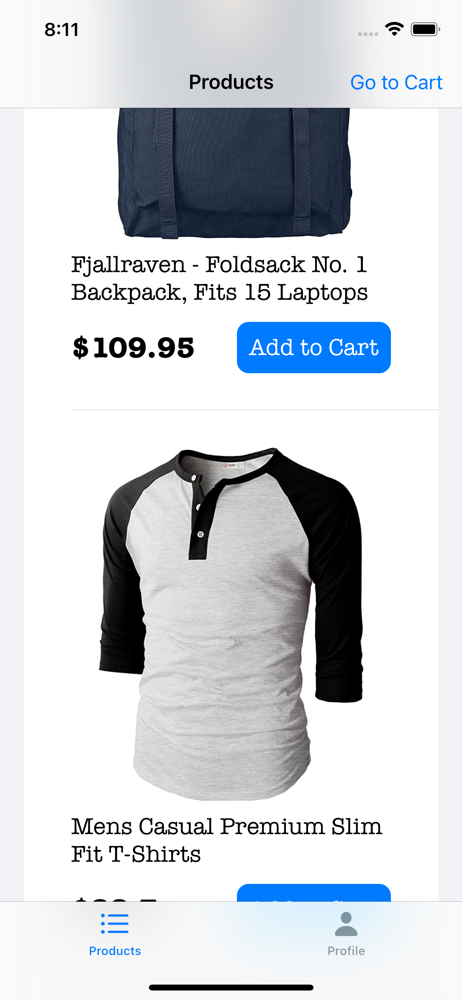
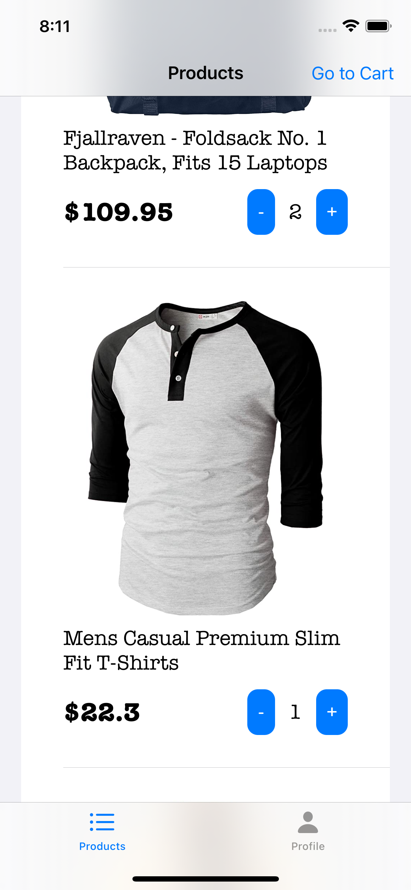
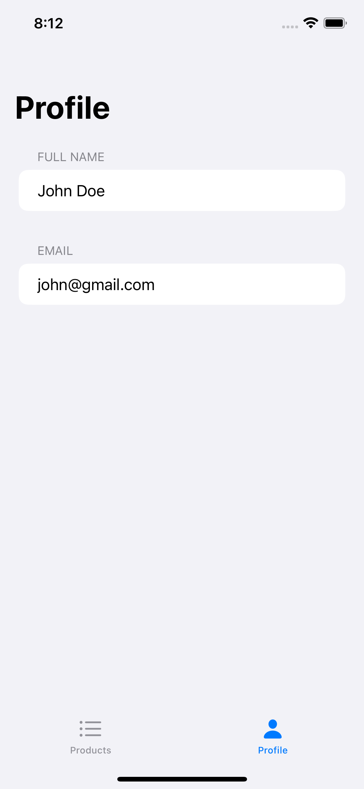
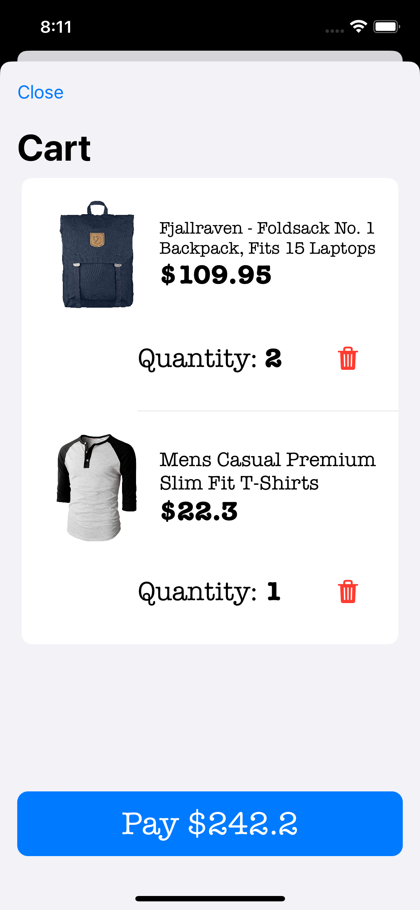
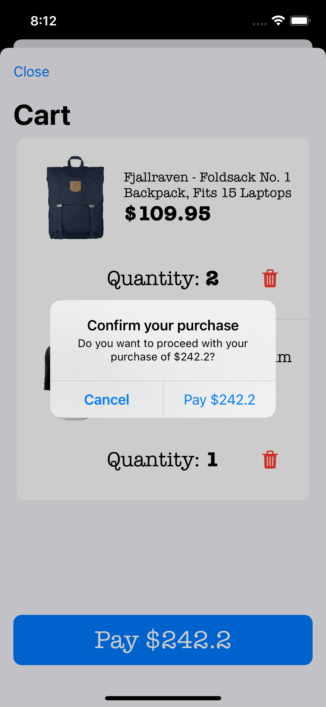
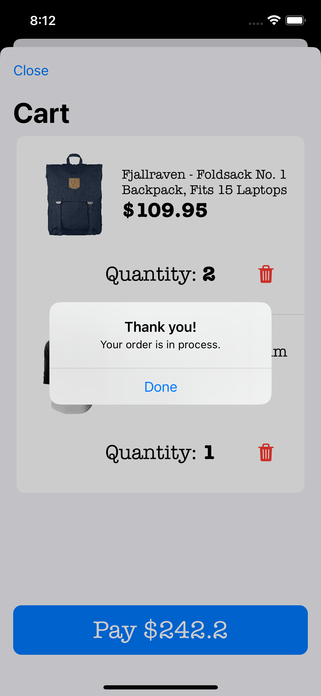
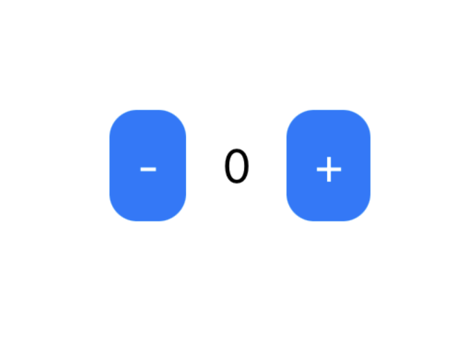

# Online Store made with Composable Architecture (TCA)
The purpose of this demo is to explore the main concepts of TCA. If this is your first time reading about it, I **strongly** recommend you to read first the README from the [main repo](https://github.com/pointfreeco/swift-composable-architecture) and watch the [Tour of TCA](https://www.pointfree.co/collections/composable-architecture/a-tour-of-the-composable-architecture).

## Motivation
**TL;DR:** Build an app with TCA not too simple nor too complex to study the most important use cases, and provide concise documentation to new learners.

I wanted to demostrate the power of this great architecture to build applications for Apple ecosystem, like iOS, macOS, etc. (btw, soon will be expanded beyond Apple world! 🚀).

However, if you want to start learning TCA, you will find a lot of articles describing a simple one-screen application to ilustrate the main concepts. Don't get me wrong, that's a great way to start, but I feel that we have a gap between very simple demos and real world applications like [isoword](https://github.com/pointfreeco/isowords) that could be too complex to understand some other important use cases (like navigation and how reducers are glued).

In this demo I've implemented a minimal online store that is actually connecting to a real network API (https://fakestoreapi.com). We got a list of products available, we can choose to add an item to the cart, add more than one item like any other e-commerce app (like Amazon for example), and once you are ready to purchase, move to the cart and send your order to the server.

Of course, we are using fakestoreapi.com, which means your requests aren't going to be processed for real, but all the networks status are, and you can play with it to map what it would be working with network calls using TCA.

Even if this demo is not considered a real-world app, it has enough reducers to ilustrate how data should be glued in order to interact together and isolate domains that only cared for very specific components within the app (For example: Tabs -> Product List -> Product Cell -> Add to Cart button).

Additionally, I've created tests to demostrate one of the key features of TCA and how it makes a test to fail if you didn't capture the actual mutation of your state.

Note: Feel free to recommend any change that may be great to teach a concept in a better way or something that you consider should be here too! :) 

## Screenshots
### Tabs
||

### Cart
||

## The basics
### Archiecture Diagram

### Context
Let's say that you have a simple app with two buttons, one will increase a counter in the screen and the other will decrease it. This is what will happen if this app was implemented on TCA:

1. The view is presented in the screen.

2. ...

### More coming ...
